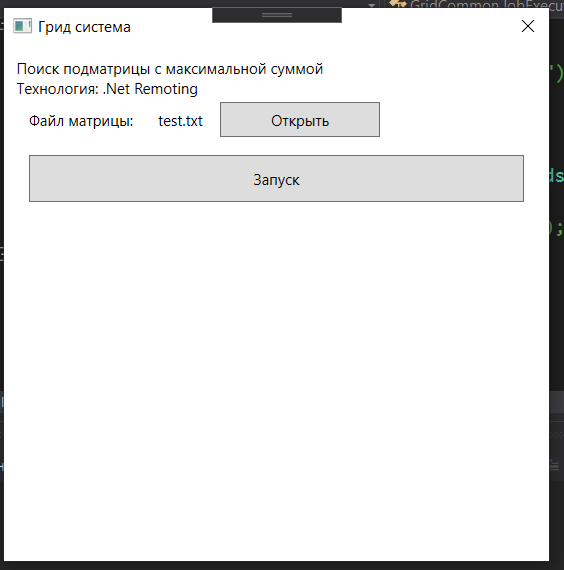
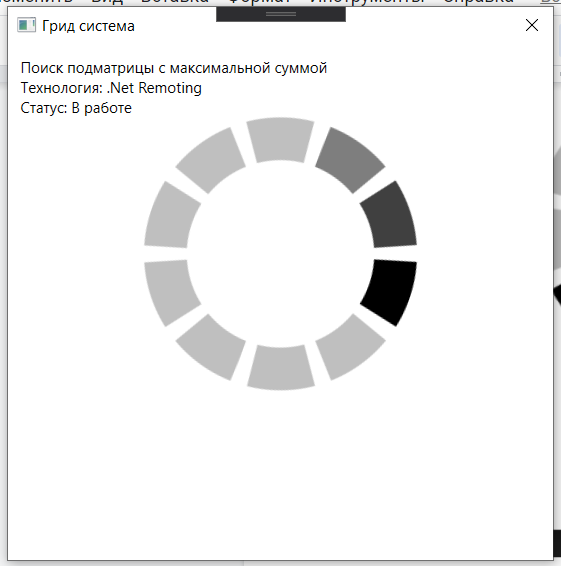
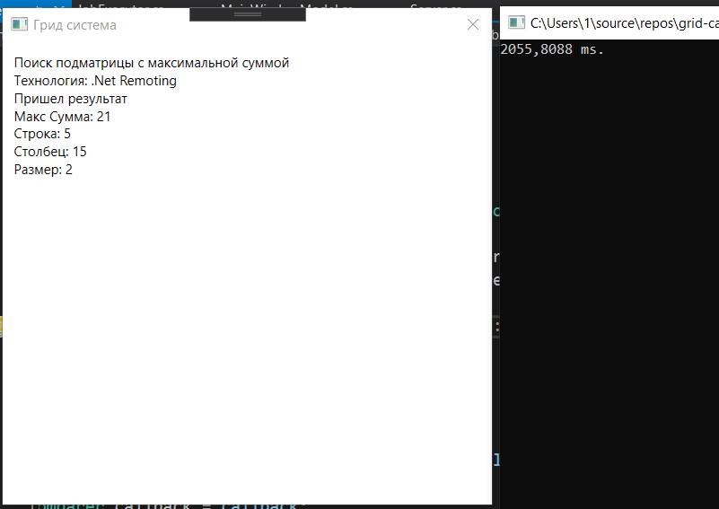
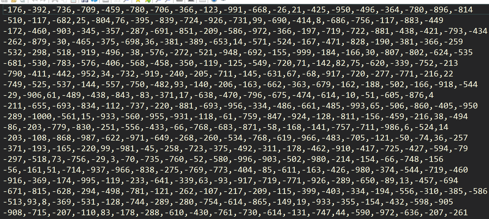

# ЗАЧЕТНАЯ РАБОТА
по дисциплине «Основы грид - вычислений»
Саратов 2020

## Описание задачи:

### Подматрица с наибольшей суммой

Дана матрица размером N×N, содержащая положительные и
отрицательные числа. Необходимо найти квадратную подматрицу с максимально возможной суммой.

## Решение:

### Указание на способ распределения задачи

Способ разделения состоит в следующем: матрица делится на множество из
чисел, первое - Io индекс, позиция откуда будет начинаться расчет сумм.
Второе - S размер подматрицы которую будем вычислять. Третье - I1 индекс
последнего элемента, от которого будет рассчитана матрица. Такое
разделение позволяет уравнять кол-во вычислений между клиентами-гридами.
Вычисление индекса происходит таким образом, чтобы он охватывал
фиксированное количество элементов подматрицы. Количество вычисляемых
подматриц и является параметром. Но в любом случае будет ограничивать
запросы где размер вычисляемой матрицы больше чем параметр система не
будет . Клиент грид системы берет работу у сервера, начав с индекса Io
начинает перебор и подсчет сумм всех матриц размером S, заканчивая
границей массива либо индексом I1. Сервер системы после просчета всех
матриц одного размера, отдает матрицы с размером на 1 больше, и так до
момента когда будет достигнут размер самой матрицы.

### Мотивация обеспечения эффективности распределения

В грид - вычислениях узким местом является время пересылки по сети,
время разделения задачи на подзадачи. Поэтому в первую очередь нужно
определить при каком размере матрицы имеет смысл разделение задачи на
подзадачи.

Ниже приведены результаты небольшого исследования, показывающее как
растет время выполнения полного перебора для решения задачи:

10x10: 12 мс

100x100: 2 сек

200x200: 41 сек

300x300: 148 сек

400x400: 356 сек

500x500: 1214 сек

По результатам видно, что при размере матрицы 500x500 время значительно
увеличивается, поэтому использовать грид-систему стоит именно при
большем или равном размере матрицы.

### Описание развернутой распределенной вычислительной среды

Проанализировав доступные грид - системы, мною с коллегами было принято
решение реализовать собственную грид - систему. Непосредственно сама
система состоит из 3 функциональных модулей: Client, Server и
GridController, в который входят JobsFactory (разбивает задачу на
подзадачи), JobsExecutor (рассчитывает задачу и выдает результат),
JobsComparer (выбирает из всех результатов наиболее подходящий, и при
окончании отдает результат в UI).

Server -- приложение, на котором загружается исходный файл с матрицей,
имеющее UI реализованный на WPF.

Client -- ожидает сервер, берет в работу job и возвращает результат
выполнения.

Технологии, используемые в разработке проекта:

-   .NET Framework, .NET Remoting, WPF.

## Скриншоты выполнения примера задачи

{width="4.678125546806649in"
height="4.727892607174104in"}

*Рисунок 1WPF приложение с выбранным файлом матрицы*

{width="4.20109908136483in"
height="4.238541119860018in"}

*Рисунок 2 Запущенный сервер*

{width="6.0947922134733155in"
height="4.307376421697287in"}

*Рисунок 3 Результат и отработанный клиент*

{width="6.498611111111111in"
height="2.9027777777777777in"}

*Рисунок 4 Формат данных матрицы*
